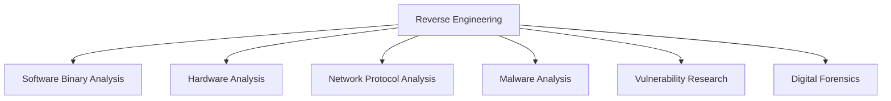

# Week 01 — Pengenalan, Ruang Lingkup, Sejarah, serta Aspek Etika dan Legalitas Reverse Engineering

---

# Ringkasan

Pada pertemuan pertama, saya mempelajari fondasi dasar **Reverse Engineering (RE)** sebagai langkah awal untuk memahami proses analisis perangkat lunak dan sistem secara menyeluruh. Materi ini membahas pengertian reverse engineering, ruang lingkup penerapannya, sejarah perkembangannya, serta aspek etika dan legalitas yang harus dipahami sebelum mempelajari teknik-teknik yang lebih mendalam.

Melalui materi ini, saya memahami bahwa reverse engineering bukan sekadar aktivitas membongkar suatu aplikasi atau perangkat lunak, tetapi merupakan proses analisis yang sistematis untuk memahami cara kerja suatu sistem tanpa memiliki source code aslinya. Selain itu, saya juga belajar bahwa kemampuan teknis dalam reverse engineering harus selalu diimbangi dengan pemahaman mengenai regulasi hukum dan etika profesi agar praktik yang dilakukan tetap legal dan bertanggung jawab.

---

# Pembahasan Materi

## 1. Pengertian Reverse Engineering dan Ruang Lingkupnya

Reverse engineering merupakan proses menganalisis suatu sistem untuk mengidentifikasi komponen-komponen penyusunnya, hubungan antar komponen tersebut, serta memahami bagaimana sistem bekerja secara keseluruhan. Hasil dari proses ini dapat berupa representasi sistem dalam bentuk yang lebih mudah dipahami atau berada pada tingkat abstraksi yang lebih tinggi.

Berbeda dengan **Forward Engineering**, yang dimulai dari kebutuhan pengguna hingga menghasilkan produk akhir, reverse engineering memulai proses analisis dari produk yang telah jadi kemudian menelusuri kembali logika maupun desain pembangunnya.

Perbandingan alur keduanya dapat digambarkan sebagai berikut:

```text
Forward Engineering

Requirements
      │
      ▼
Design & Source Code
      │
      ▼
Executable / Binary
```

```text
Reverse Engineering

Executable / Binary
        │
        ▼
Analysis & Disassembly
        │
        ▼
Logic Abstraction / Source Code Representation
```

Dalam bidang Teknik Komputer, reverse engineering memiliki ruang lingkup yang luas, meliputi:

- Analisis perangkat lunak (Software Binary Analysis)
- Analisis perangkat keras (Hardware Reverse Engineering)
- Analisis protokol jaringan
- Malware Analysis
- Vulnerability Research
- Interoperabilitas antar sistem

Penerapan tersebut menjadikan reverse engineering sebagai salah satu kompetensi penting dalam dunia keamanan siber modern.

---

## 2. Sejarah Perkembangan Reverse Engineering

Reverse engineering telah berkembang sejak lama, bahkan sebelum era komputer modern. Pada awalnya, teknik ini banyak digunakan dalam industri manufaktur dan militer untuk membongkar produk atau perangkat milik kompetitor guna memahami desain serta teknologi yang digunakan.

Seiring berkembangnya teknologi informasi, reverse engineering mulai diterapkan pada perangkat lunak dan sistem komputer. Kebutuhan akan interoperabilitas antar sistem dari vendor yang berbeda menjadi salah satu faktor yang mendorong perkembangan teknik ini.

Saat ini reverse engineering telah menjadi bagian penting dalam dunia cybersecurity, khususnya untuk:

- Menganalisis malware baru yang belum dikenali antivirus.
- Menemukan celah keamanan pada suatu aplikasi.
- Memahami mekanisme kerja software proprietary.
- Mendukung proses digital forensics.

Perkembangan tersebut menunjukkan bahwa reverse engineering kini tidak hanya digunakan untuk memahami suatu produk, tetapi juga sebagai sarana meningkatkan keamanan sistem informasi.

---

## 3. Aspek Hukum dan Legalitas Reverse Engineering

Salah satu materi yang paling penting pada minggu pertama adalah memahami batasan hukum dalam melakukan reverse engineering.

Di tingkat internasional, aktivitas ini berkaitan dengan **Digital Millennium Copyright Act (DMCA)** dan berbagai bentuk lisensi perangkat lunak seperti **End User License Agreement (EULA)**. Pada umumnya, lisensi tersebut membatasi aktivitas pembongkaran perangkat lunak untuk melindungi hak kekayaan intelektual.

Namun demikian, terdapat beberapa pengecualian yang diizinkan secara hukum, antara lain:

### Interoperabilitas

Reverse engineering diperbolehkan apabila bertujuan agar dua sistem atau perangkat lunak yang berbeda dapat saling berkomunikasi dan bekerja bersama.

### Keamanan Sistem

Reverse engineering juga dapat dilakukan untuk melakukan penelitian keamanan (security research) guna menemukan dan memperbaiki kerentanan sebelum dimanfaatkan oleh pihak yang tidak bertanggung jawab.

Di Indonesia, aktivitas reverse engineering berkaitan dengan **Undang-Undang Informasi dan Transaksi Elektronik (UU ITE)**. Akses tanpa izin terhadap suatu sistem atau modifikasi sistem tanpa hak dapat dikategorikan sebagai pelanggaran hukum. Oleh karena itu, reverse engineering sebaiknya dilakukan pada:

- Sistem milik sendiri.
- Sampel malware pada lingkungan laboratorium yang terisolasi.
- Sistem yang telah memberikan izin resmi, misalnya melalui program Bug Bounty.

---

## 4. Etika dalam Reverse Engineering

Selain memahami aspek hukum, seorang reverse engineer juga harus menjunjung tinggi etika profesi.

Materi minggu ini memperkenalkan konsep **Responsible Disclosure**, yaitu prosedur etis ketika menemukan suatu kerentanan keamanan.

Tahapan yang dilakukan meliputi:

- Melaporkan kerentanan kepada vendor secara privat.
- Memberikan waktu kepada pengembang untuk melakukan perbaikan (patching).
- Mempublikasikan hasil penelitian setelah kerentanan berhasil diperbaiki.

Pendekatan ini bertujuan untuk melindungi pengguna sekaligus memberikan kesempatan kepada pengembang memperbaiki sistem sebelum informasi tersebut diketahui oleh pihak yang dapat menyalahgunakannya.

Konsep tersebut juga menjadi dasar berbagai program **Bug Bounty**, yaitu program penghargaan bagi peneliti keamanan yang berhasil menemukan dan melaporkan kerentanan secara legal.

---

## 5. Reverse Engineering dalam Industri Keamanan Siber

Pada bagian akhir materi dijelaskan bahwa reverse engineering merupakan salah satu kompetensi inti dalam bidang keamanan siber.

Beberapa penerapannya antara lain:

### Malware Analysis

Menganalisis file berbahaya untuk memahami perilaku, teknik penyebaran, serta dampak yang ditimbulkan tanpa menjalankannya pada sistem utama.

### Vulnerability Research

Mencari kelemahan keamanan pada perangkat lunak agar dapat diperbaiki sebelum dimanfaatkan oleh pelaku kejahatan siber.

### Capture The Flag (CTF)

Menggunakan reverse engineering sebagai sarana latihan dan kompetisi untuk meningkatkan kemampuan analisis terhadap file biner dan berbagai tantangan keamanan lainnya.

Penerapan tersebut menunjukkan bahwa reverse engineering memiliki peranan yang sangat besar dalam menjaga keamanan sistem informasi modern.

---

# Diagram Ruang Lingkup Reverse Engineering



---

# Insight Minggu Ini

Materi pada minggu pertama mengubah pemahaman saya mengenai reverse engineering. Sebelumnya saya menganggap aktivitas ini identik dengan pembajakan perangkat lunak atau tindakan ilegal, namun setelah mempelajari materi saya memahami bahwa reverse engineering merupakan disiplin ilmu yang legal apabila dilakukan sesuai tujuan, prosedur, dan ketentuan hukum yang berlaku.

Saya juga menyadari bahwa kemampuan teknis saja tidak cukup untuk menjadi seorang reverse engineer yang baik. Diperlukan pemahaman mengenai etika profesi, tanggung jawab moral, serta kepatuhan terhadap regulasi agar ilmu yang dimiliki dapat digunakan untuk meningkatkan keamanan sistem, bukan untuk merugikan pihak lain.

---

# Tools yang Dipelajari

- Platform Bug Bounty (HackerOne, Bugcrowd)
- Dokumen Digital Millennium Copyright Act (DMCA)
- Undang-Undang Informasi dan Transaksi Elektronik (UU ITE)
- End User License Agreement (EULA)
- Virtual Machine sebagai lingkungan laboratorium terisolasi

---

# Refleksi Pembelajaran

## Apa yang Saya Pahami

Setelah mempelajari materi minggu pertama, saya memahami bahwa reverse engineering merupakan proses analisis sistem yang dilakukan dari produk jadi menuju pemahaman terhadap desain dan logika pembangunnya. Saya juga memahami bahwa reverse engineering memiliki ruang lingkup yang luas, mulai dari analisis perangkat lunak, perangkat keras, hingga penelitian keamanan siber.

Selain aspek teknis, saya memperoleh pemahaman mengenai pentingnya mematuhi regulasi hukum dan etika profesi, sehingga setiap aktivitas reverse engineering dilakukan secara legal, bertanggung jawab, dan memberikan manfaat bagi keamanan sistem.

## Apa yang Masih Membingungkan

Saya masih ingin mempelajari lebih dalam bagaimana penerapan reverse engineering pada kasus nyata, seperti analisis malware berskala besar maupun investigasi terhadap serangan siber terkenal. Selain itu, saya juga ingin memahami secara lebih rinci implementasi pasal-pasal dalam UU ITE yang berkaitan dengan penelitian keamanan terhadap aplikasi publik.

## Kesimpulan Pribadi

Materi minggu pertama memberikan fondasi yang sangat penting sebelum mempelajari teknik reverse engineering yang lebih kompleks. Saya menyadari bahwa reverse engineering bukan hanya sekadar kemampuan membongkar suatu sistem, tetapi juga membutuhkan pemahaman mengenai aspek hukum, etika, serta tanggung jawab profesional. Dengan bekal tersebut, saya memiliki dasar yang kuat untuk mempelajari proses analisis perangkat lunak secara lebih mendalam pada pertemuan-pertemuan berikutnya.

---
