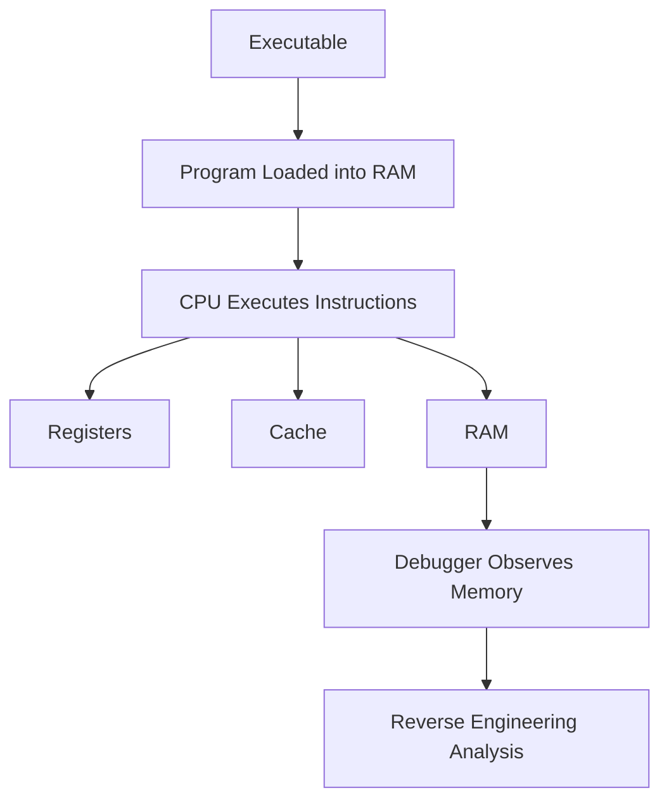

# Week 02 — Memahami Arsitektur Memori sebagai Dasar Reverse Engineering

---

# Ringkasan

Pada pertemuan kedua, saya mempelajari bagaimana sebuah program memanfaatkan memori komputer selama proses eksekusi. Materi ini membahas konsep dasar arsitektur memori, hubungan antara CPU, register, cache, RAM, hingga media penyimpanan, serta bagaimana seluruh komponen tersebut bekerja sama ketika sebuah program dijalankan.

Selain itu, saya juga mempelajari perbedaan pendekatan pengelolaan memori pada bahasa pemrograman **C** dan **Java**. Melalui materi ini saya memahami bahwa reverse engineering tidak hanya berfokus pada membaca instruksi assembly, tetapi juga menuntut pemahaman mengenai bagaimana data disimpan, dipindahkan, dan dimanipulasi di dalam memori. Pengetahuan tersebut menjadi fondasi penting dalam proses debugging maupun analisis perilaku suatu aplikasi.

---

# Pembahasan Materi

## 1. Pentingnya Memori dalam Reverse Engineering

Ketika sebuah program dijalankan, sistem operasi akan memuat file executable ke dalam **Random Access Memory (RAM)**. Setelah itu, CPU mengambil instruksi dan data dari memori untuk diproses secara berurutan hingga program selesai dijalankan.

Bagi seorang **Reverse Engineer**, memori merupakan salah satu objek analisis yang paling penting karena berbagai informasi program berada di dalamnya, seperti nilai variabel, alamat fungsi, parameter, hingga data yang sedang diproses.

Alur sederhananya dapat digambarkan sebagai berikut:

```text
Executable
      │
      ▼
Program dimuat ke RAM
      │
      ▼
CPU menjalankan instruksi
      │
      ▼
Debugger mengamati isi memori
```

Melalui proses tersebut, seorang analis dapat memahami perilaku suatu program secara langsung tanpa harus memiliki source code asli. Dengan bantuan debugger, isi memori dapat diamati dan dianalisis selama proses eksekusi berlangsung.

---

## 2. Perbedaan Pengelolaan Memori pada Bahasa C dan Java

Salah satu pembahasan utama pada minggu ini adalah bagaimana bahasa pemrograman mengelola penggunaan memori.

### Bahasa C

Bahasa C menggunakan pendekatan **manual memory management**, yaitu programmer bertanggung jawab sepenuhnya terhadap proses alokasi maupun pembebasan memori.

Pengelolaan memori dilakukan secara eksplisit menggunakan fungsi-fungsi tertentu sehingga memberikan fleksibilitas dan efisiensi yang tinggi. Namun, pendekatan ini juga memiliki risiko apabila programmer melakukan kesalahan.

Beberapa permasalahan yang sering muncul antara lain:

- Buffer Overflow
- Memory Leak
- Dangling Pointer
- Use After Free

Kesalahan-kesalahan tersebut dapat menyebabkan **memory corruption**, yang sering dimanfaatkan oleh penyerang untuk mengeksploitasi suatu aplikasi.

---

### Bahasa Java

Berbeda dengan C, Java menggunakan mekanisme **automatic memory management** melalui **Garbage Collection**.

Seluruh objek disimpan di dalam heap, kemudian **Java Virtual Machine (JVM)** akan secara otomatis mendeteksi objek yang sudah tidak lagi digunakan dan membebaskan memori yang ditempatinya.

Keuntungan pendekatan ini meliputi:

- Mengurangi kesalahan dalam pengelolaan memori.
- Meminimalkan risiko terjadinya memory corruption.
- Memungkinkan programmer lebih fokus pada logika aplikasi.

Walaupun demikian, seorang Reverse Engineer tetap perlu memahami cara kerja Garbage Collector agar dapat melakukan analisis dinamis terhadap aplikasi berbasis Java.

---

## 3. Hubungan Debugger dengan RAM

Debugger merupakan salah satu alat utama yang digunakan dalam reverse engineering untuk mengamati perilaku program selama proses eksekusi.

Dengan menggunakan debugger, berbagai informasi penting dapat diamati secara langsung, antara lain:

- Isi register CPU.
- Nilai variabel.
- Alamat memori.
- Kondisi stack dan heap.
- Perubahan data setelah suatu instruksi dijalankan.

Kemampuan tersebut membantu analis memahami alur eksekusi program, menemukan logika aplikasi, serta mengidentifikasi kemungkinan adanya kerentanan keamanan tanpa memerlukan source code.

---

## 4. Hirarki Memori Komputer

Materi minggu ini juga membahas mengenai hirarki memori yang terdapat pada sistem komputer.

```text
Register
    │
    ▼
Cache
    │
    ▼
RAM
    │
    ▼
SSD / HDD
```

Setiap jenis memori memiliki karakteristik yang berbeda.

- **Register** merupakan media penyimpanan tercepat yang berada langsung di dalam CPU.
- **Cache** berfungsi menyimpan data yang sering diakses agar proses komputasi menjadi lebih cepat.
- **RAM** digunakan sebagai tempat penyimpanan sementara ketika program dijalankan.
- **SSD/HDD** berfungsi sebagai media penyimpanan permanen dengan kapasitas besar namun memiliki kecepatan akses yang lebih rendah dibandingkan RAM.

Pemahaman mengenai hirarki memori membantu menjelaskan bagaimana data berpindah selama proses eksekusi program serta alasan mengapa beberapa proses dapat berjalan dengan sangat cepat.

---

## 5. Hubungan Manajemen Memori dengan Keamanan Sistem

Pada bagian akhir materi dijelaskan bahwa banyak kerentanan keamanan berasal dari kesalahan dalam pengelolaan memori.

Sebagai contoh, aplikasi yang dikembangkan menggunakan bahasa C memiliki risiko mengalami **buffer overflow** apabila data yang ditulis melebihi kapasitas memori yang telah dialokasikan. Kerentanan seperti ini sering dimanfaatkan oleh penyerang untuk mengambil alih kontrol program.

Sementara itu, Java memiliki mekanisme keamanan tambahan melalui JVM dan Garbage Collector sehingga pengelolaan memori menjadi lebih aman dan terkontrol.

Oleh karena itu, pemahaman mengenai manajemen memori tidak hanya penting bagi programmer, tetapi juga menjadi bekal utama bagi seorang analis keamanan maupun Reverse Engineer dalam memahami sumber munculnya berbagai kerentanan pada perangkat lunak.

---

# Diagram Arsitektur Memori dalam Reverse Engineering



---

# Hal Baru yang Saya Pelajari

Beberapa konsep baru yang saya pelajari pada minggu ini meliputi:

- Fungsi RAM ketika sebuah program dijalankan.
- Perbedaan penggunaan stack dan heap dalam penyimpanan data.
- Cara kerja Garbage Collection pada Java.
- Risiko penggunaan pointer yang tidak tepat pada bahasa C.
- Peran debugger dalam mengamati kondisi memori selama proses eksekusi program.

---

# Insight Minggu Ini

Materi minggu kedua memberikan pemahaman baru bahwa analisis perangkat lunak tidak dapat dipisahkan dari pemahaman mengenai arsitektur memori. Sebelumnya saya menganggap reverse engineering hanya berfokus pada membaca instruksi assembly, namun ternyata sebagian besar proses analisis dilakukan dengan mengamati bagaimana data disimpan dan berubah di dalam memori saat program sedang berjalan.

Saya juga memahami bahwa pemilihan bahasa pemrograman memengaruhi tingkat keamanan suatu aplikasi. Bahasa C memberikan kendali penuh terhadap memori sehingga lebih fleksibel, tetapi juga lebih rentan terhadap kesalahan. Sebaliknya, Java menawarkan pengelolaan memori otomatis yang membantu mengurangi berbagai risiko kerusakan memori.

---

# Tools yang Dipelajari

- x64dbg
- GDB
- WinDbg
- Java Virtual Machine (JVM)
- Process Explorer

---

# Refleksi Pembelajaran

## Apa yang Saya Pahami

Setelah mempelajari materi minggu kedua, saya memahami bahwa memori merupakan komponen yang sangat penting dalam proses reverse engineering. Saya mengetahui bagaimana register, cache, RAM, dan media penyimpanan bekerja sama ketika sebuah program dijalankan. Saya juga memahami perbedaan pendekatan pengelolaan memori pada bahasa C dan Java beserta implikasinya terhadap keamanan aplikasi.

Selain itu, saya memahami bahwa debugger berperan sebagai alat utama untuk mengamati kondisi memori, sehingga seorang Reverse Engineer dapat memahami perilaku suatu program secara langsung selama proses eksekusi.

## Apa yang Masih Membingungkan

Saya masih ingin mempelajari bagaimana debugger dapat menghentikan eksekusi program pada instruksi tertentu menggunakan breakpoint, serta bagaimana proses tersebut dilakukan tanpa mengubah perilaku asli program. Selain itu, saya juga ingin memahami lebih dalam mekanisme Garbage Collector dalam menentukan objek yang sudah tidak lagi digunakan sehingga dapat dibebaskan dari heap memory.

## Kesimpulan Pribadi

Materi minggu kedua memberikan dasar yang sangat penting dalam memahami hubungan antara arsitektur komputer dan reverse engineering. Saya menyadari bahwa hampir seluruh aktivitas program berlangsung di dalam memori, sehingga memahami cara kerja memori akan sangat membantu dalam proses debugging maupun analisis executable. Bekal ini menjadi landasan untuk mempelajari teknik reverse engineering yang lebih kompleks pada pertemuan-pertemuan selanjutnya.

---
