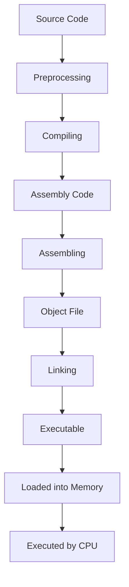

# Week 03 — Binary & Executable

---

# Ringkasan

Pada pertemuan ketiga, saya mempelajari konsep dasar mengenai **Binary** dan **Executable** sebagai fondasi utama dalam proses reverse engineering. Materi ini menjelaskan bagaimana sebuah program dibangun mulai dari source code hingga menjadi file executable yang dapat dijalankan oleh sistem operasi. Selain itu, saya juga mempelajari berbagai format file executable, struktur internalnya, konsep endianness, serta kaitannya dengan proses analisis perangkat lunak.

Melalui materi ini saya memahami bahwa sebelum melakukan reverse engineering, seorang analis harus mengetahui bagaimana sebuah executable disusun dan bagaimana sistem operasi memuat file tersebut ke dalam memori. Pengetahuan ini menjadi dasar untuk menggunakan disassembler, decompiler, maupun hex editor dalam menganalisis suatu aplikasi.

---

# Pembahasan Materi

## 1. Pengertian Binary dan Executable

**Binary (Biner)** merupakan representasi data paling dasar yang dapat dipahami oleh prosesor (CPU). Binary terdiri dari kombinasi angka **0** dan **1** yang merepresentasikan instruksi maupun data pada tingkat paling rendah.

Dalam konteks reverse engineering, istilah **binary** umumnya merujuk pada **machine code**, yaitu kumpulan instruksi yang telah disesuaikan dengan arsitektur prosesor tertentu, seperti **x86**, **x64**, atau **ARM**, sehingga dapat dieksekusi secara langsung oleh perangkat keras.

Sementara itu, **Executable** adalah file hasil proses kompilasi yang memiliki struktur tertentu sehingga dapat dikenali oleh sistem operasi dan dimuat ke dalam memori untuk dijalankan sebagai sebuah program.

Dengan kata lain, executable merupakan bentuk akhir dari suatu aplikasi yang siap dieksekusi oleh komputer.

---

## 2. Proses Terbentuknya File Executable

Sebelum menjadi sebuah executable, source code harus melalui beberapa tahapan proses pembangunan (build process).

Tahapan tersebut meliputi:

### Preprocessing

Tahap awal yang bertugas memproses berbagai direktif pada source code, seperti:

- `#include`
- `#define`
- Macro lainnya

Pada tahap ini belum dilakukan penerjemahan menjadi bahasa mesin.

---

### Compiling

Compiler menerjemahkan source code menjadi bahasa **Assembly** sesuai dengan arsitektur prosesor yang digunakan.

Tahap ini juga melakukan berbagai proses optimasi terhadap kode program.

---

### Assembling

Assembler mengubah instruksi Assembly menjadi **Machine Code** dalam bentuk **Object File** (`.obj` atau `.o`).

Object file masih belum dapat dijalankan karena belum memiliki seluruh dependensi yang dibutuhkan.

---

### Linking

Tahap terakhir adalah **Linking**, yaitu menggabungkan beberapa object file beserta library yang diperlukan sehingga menghasilkan satu file executable yang utuh dan siap dijalankan.

Alur pembentukan executable dapat digambarkan sebagai berikut:

```text
Source Code
      │
      ▼
Preprocessing
      │
      ▼
Compiling
      │
      ▼
Assembly Code
      │
      ▼
Assembling
      │
      ▼
Object File
      │
      ▼
Linking
      │
      ▼
Executable
```

---

## 3. Format File Executable

Setiap sistem operasi memiliki format executable yang berbeda.

Beberapa format executable yang paling umum digunakan antara lain:

| Format | Sistem Operasi | Karakteristik |
| ------- | -------------- | ------------- |
| PE (Portable Executable) | Windows | Digunakan untuk file `.exe`, `.dll`, dan `.sys`, dengan magic header **MZ**. |
| ELF (Executable and Linkable Format) | Linux / Unix | Digunakan pada sistem Linux dan Unix dengan magic header **0x7F 45 4C 46 (.ELF)**. |
| Mach-O | macOS / iOS | Format executable yang digunakan pada sistem operasi Apple. |

Perbedaan format tersebut menyebabkan teknik analisis reverse engineering juga harus disesuaikan dengan sistem operasi yang digunakan.

---

## 4. Struktur Internal Executable

Sebuah file executable memiliki struktur internal yang terdiri atas beberapa bagian (section), di mana setiap section memiliki fungsi yang berbeda.

### Header

Bagian header berisi informasi penting mengenai executable, seperti:

- Arsitektur CPU.
- Entry Point.
- Jumlah section.
- Informasi metadata lainnya.

Header menjadi bagian pertama yang dibaca oleh sistem operasi sebelum menjalankan program.

---

### .text Section

Section ini berisi **Machine Code** atau instruksi-instruksi yang akan dieksekusi langsung oleh CPU.

Dalam reverse engineering, bagian inilah yang paling sering dianalisis menggunakan disassembler.

---

### .data Section

Section ini digunakan untuk menyimpan:

- Variabel global.
- Variabel statis.
- Data yang telah diinisialisasi.

Nilai-nilai tersebut akan dimuat ke dalam memori ketika program dijalankan.

---

### .rsrc Section

Pada sistem operasi Windows, section **.rsrc** digunakan untuk menyimpan berbagai resource aplikasi, seperti:

- Ikon.
- Gambar.
- Dialog.
- Menu.
- String aplikasi.

Section ini juga sering dianalisis untuk memperoleh informasi tambahan mengenai suatu aplikasi.

---

## 5. Konsep Endianness

Materi minggu ini juga mengenalkan konsep **Endianness**, yaitu cara komputer menyimpan data yang terdiri dari beberapa byte di dalam memori.

Terdapat dua jenis endianness, yaitu:

### Little Endian

Pada metode ini, byte dengan nilai paling kecil (**Least Significant Byte**) disimpan terlebih dahulu pada alamat memori yang paling rendah.

Pendekatan ini digunakan oleh sebagian besar prosesor modern seperti:

- Intel x86
- Intel x64
- AMD64

---

### Big Endian

Pada metode ini, byte dengan nilai paling besar (**Most Significant Byte**) disimpan terlebih dahulu pada alamat memori yang paling rendah.

Pendekatan ini digunakan pada beberapa arsitektur tertentu, seperti:

- Mainframe
- Beberapa prosesor RISC

Pemahaman mengenai endianness sangat penting ketika membaca data menggunakan debugger maupun hex editor agar interpretasi nilai yang diperoleh tidak keliru.

---

## 6. Relevansi Binary dan Executable dalam Reverse Engineering

Karena source code asli umumnya tidak tersedia, seorang Reverse Engineer harus menganalisis file executable secara langsung.

Untuk membantu proses tersebut digunakan beberapa tools utama, yaitu:

### Disassembler

Disassembler menerjemahkan machine code menjadi bahasa Assembly sehingga struktur logika program lebih mudah dipahami.

Contoh tools:

- IDA Pro
- Ghidra

---

### Decompiler

Decompiler mencoba mengubah machine code menjadi bahasa pemrograman tingkat tinggi, seperti C atau C++, sehingga logika program lebih mudah dianalisis.

Salah satu contoh decompiler yang populer adalah **Hex-Rays**.

---

### Hex Editor

Hex Editor digunakan untuk melihat isi file executable dalam bentuk data hexadecimal.

Selain membaca isi binary, tools ini juga dapat digunakan untuk melakukan modifikasi sederhana terhadap file executable.

Contoh yang umum digunakan adalah **HxD**.

---

# Diagram Proses Pembentukan Executable



---

# Hal Baru yang Saya Pelajari

Beberapa konsep baru yang saya pelajari pada minggu ini meliputi:

- Perbedaan antara binary dan executable.
- Tahapan pembentukan executable mulai dari preprocessing hingga linking.
- Berbagai format executable pada Windows, Linux, dan macOS.
- Struktur internal executable seperti Header, `.text`, `.data`, dan `.rsrc`.
- Konsep Little Endian dan Big Endian dalam penyimpanan data.
- Fungsi disassembler, decompiler, dan hex editor dalam reverse engineering.

---

# Insight Minggu Ini

Materi minggu ketiga membuat saya memahami bahwa sebuah file executable bukan sekadar kumpulan angka biner, tetapi memiliki struktur yang tersusun dengan sangat sistematis. Saya menyadari bahwa memahami struktur internal executable merupakan langkah awal sebelum melakukan analisis menggunakan berbagai tools reverse engineering.

Selain itu, saya juga memahami bahwa setiap sistem operasi memiliki format executable yang berbeda sehingga teknik analisis yang digunakan pun dapat berbeda. Pengetahuan mengenai endianness dan struktur section menjadi bekal penting untuk membaca isi binary dengan benar ketika melakukan proses debugging maupun disassembly.

---

# Tools yang Dipelajari

- IDA Pro
- Ghidra
- Hex-Rays Decompiler
- HxD Hex Editor

---

# Refleksi Pembelajaran

## Apa yang Saya Pahami

Setelah mempelajari materi minggu ketiga, saya memahami bagaimana sebuah program dibangun hingga menjadi file executable yang siap dijalankan oleh sistem operasi. Saya juga memahami struktur internal executable beserta fungsi setiap section yang terdapat di dalamnya.

Selain itu, saya mengetahui bahwa reverse engineering pada dasarnya merupakan proses menganalisis executable menggunakan berbagai tools seperti disassembler, decompiler, dan hex editor agar logika program dapat dipahami tanpa memiliki source code asli.

## Apa yang Masih Membingungkan

Saya masih ingin mempelajari lebih dalam bagaimana disassembler menerjemahkan machine code menjadi instruksi assembly yang dapat dibaca manusia, serta bagaimana decompiler dapat menghasilkan pseudo-code yang menyerupai source code asli. Saya juga ingin memahami lebih lanjut proses linking dan bagaimana library eksternal dihubungkan ke dalam executable.

## Kesimpulan Pribadi

Materi minggu ketiga memberikan pemahaman yang sangat penting mengenai dasar analisis file executable dalam reverse engineering. Dengan memahami proses pembentukan executable, format file, struktur internal, serta konsep endianness, saya memiliki bekal yang lebih kuat untuk mempelajari teknik analisis binary menggunakan berbagai tools reverse engineering pada materi-materi berikutnya.

---
