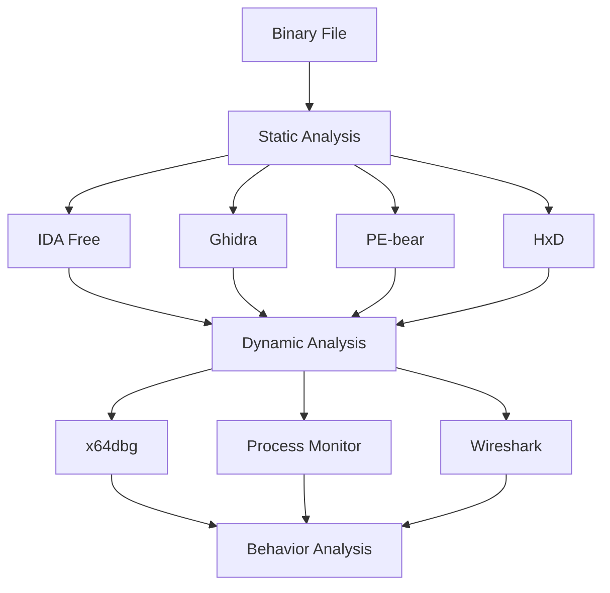

# Week 04 — Reverse Engineering Tools

---

# Ringkasan

Pada pertemuan keempat, saya mempelajari berbagai **tools** yang umum digunakan dalam proses **Reverse Engineering**. Materi ini membahas fungsi, karakteristik, serta peran masing-masing tools dalam membantu menganalisis file executable, baik melalui **static analysis** maupun **dynamic analysis**.

Melalui pembelajaran ini, saya memahami bahwa keberhasilan proses reverse engineering tidak hanya bergantung pada kemampuan memahami assembly atau struktur binary, tetapi juga pada kemampuan memilih dan menggunakan tools yang tepat sesuai tujuan analisis. Setiap tools memiliki keunggulan dan fungsi yang berbeda sehingga sering kali digunakan secara bersamaan untuk memperoleh hasil analisis yang lebih komprehensif.

---

# Pembahasan Materi

## 1. Pentingnya Tools dalam Reverse Engineering

Dalam reverse engineering, tools merupakan komponen yang sangat penting karena berfungsi membantu analis memahami struktur maupun perilaku suatu program. Tanpa bantuan tools, proses membaca machine code, mengamati alur eksekusi, maupun memonitor aktivitas program akan menjadi sangat sulit dilakukan.

Secara umum, tools reverse engineering digunakan untuk berbagai keperluan, antara lain:

- Melihat struktur internal file binary.
- Melakukan disassembly terhadap executable.
- Menganalisis alur program.
- Melakukan debugging saat program berjalan.
- Memantau aktivitas sistem dan jaringan.
- Mengidentifikasi perilaku aplikasi selama proses eksekusi.

Setiap tools dirancang untuk menyelesaikan tugas tertentu sehingga pemilihannya harus disesuaikan dengan kebutuhan analisis.

---

## 2. Tools untuk Static Analysis

**Static Analysis** merupakan proses menganalisis suatu file executable tanpa menjalankannya. Pendekatan ini bertujuan memahami struktur internal program, isi binary, maupun logika dasar aplikasi sebelum dilakukan analisis yang lebih mendalam.

Beberapa tools yang dipelajari pada minggu ini antara lain:

| Tools | Fungsi |
| ------ | ------ |
| IDA Free | Disassembler |
| Ghidra | Disassembler dan Decompiler |
| PE-bear | Analisis struktur Portable Executable (PE) |
| HxD | Hex Editor |

Melalui tools tersebut, seorang analis dapat memperoleh informasi mengenai section, fungsi, string, import library, maupun struktur executable tanpa harus mengeksekusi program.

---

## 3. IDA Free

**IDA Free** merupakan salah satu tools reverse engineering yang paling populer dan banyak digunakan oleh analis keamanan maupun malware researcher.

Fungsi utama IDA Free meliputi:

- Melakukan disassembly terhadap machine code.
- Mengidentifikasi fungsi-fungsi dalam executable.
- Menampilkan graph alur program.
- Melakukan analisis cross reference antar fungsi.

Dengan mengubah machine code menjadi bahasa Assembly, IDA Free membantu analis memahami logika program secara lebih sistematis. Fitur graph view juga mempermudah proses penelusuran alur eksekusi suatu fungsi.

---

## 4. Ghidra

**Ghidra** merupakan tools reverse engineering yang dikembangkan oleh **National Security Agency (NSA)** dan tersedia secara gratis sebagai perangkat lunak open source.

Beberapa fitur utama Ghidra antara lain:

- Disassembler.
- Decompiler.
- Function Analysis.
- Code Navigation.
- Cross Reference Analysis.

Keunggulan utama Ghidra terletak pada kemampuan **Decompiler**, yaitu menerjemahkan assembly code menjadi pseudo-code yang menyerupai bahasa pemrograman tingkat tinggi seperti C. Hal tersebut membuat proses analisis menjadi lebih mudah dipahami, terutama bagi pengguna yang belum terbiasa membaca assembly.

---

## 5. Tools untuk Dynamic Analysis

Berbeda dengan static analysis, **Dynamic Analysis** dilakukan ketika program sedang dijalankan. Tujuan utama pendekatan ini adalah mengamati perilaku aplikasi secara langsung selama proses eksekusi.

Beberapa tools yang dipelajari meliputi:

| Tools | Fungsi |
| ------ | ------ |
| x64dbg | Debugger untuk analisis runtime |
| Wireshark | Monitoring lalu lintas jaringan |
| Process Monitor | Monitoring aktivitas sistem |
| VirtualBox | Lingkungan sandbox untuk analisis |

Melalui tools tersebut, seorang analis dapat mengamati perubahan memori, aktivitas file, komunikasi jaringan, registry, maupun proses lain yang dilakukan oleh program saat berjalan.

---

## 6. Workflow Penggunaan Tools Reverse Engineering

Dalam praktiknya, proses reverse engineering umumnya dilakukan secara bertahap dengan memanfaatkan beberapa tools secara berurutan.

Alur sederhananya dapat digambarkan sebagai berikut:

```text
Binary File
      │
      ▼
Static Analysis
      │
      ▼
Disassembly & Structure Analysis
      │
      ▼
Dynamic Analysis
      │
      ▼
Behavior Analysis
```

Tahapan tersebut membantu analis memperoleh gambaran lengkap mengenai struktur internal executable sekaligus perilaku program selama dijalankan.

Biasanya hasil dari static analysis akan menjadi acuan ketika melakukan debugging maupun analisis dinamis sehingga proses investigasi menjadi lebih efektif.

---

# Diagram Workflow Reverse Engineering Tools



---

# Hal Baru yang Saya Pelajari

Beberapa konsep baru yang saya pelajari pada minggu ini antara lain:

- Perbedaan fungsi tools untuk static analysis dan dynamic analysis.
- Cara kerja disassembler dalam menerjemahkan machine code menjadi assembly.
- Fungsi decompiler untuk menghasilkan pseudo-code.
- Analisis struktur executable menggunakan PE-bear.
- Penggunaan debugger untuk mengamati perilaku program saat runtime.
- Pentingnya penggunaan virtual machine sebagai lingkungan analisis yang aman.

---

# Insight Minggu Ini

Materi minggu keempat membuat saya memahami bahwa tools merupakan bagian yang tidak terpisahkan dari proses reverse engineering. Setiap tools memiliki spesialisasi yang berbeda sehingga tidak ada satu tools yang mampu menyelesaikan seluruh proses analisis secara mandiri.

Saya juga menyadari bahwa kombinasi antara static analysis dan dynamic analysis memberikan hasil yang jauh lebih lengkap dibandingkan hanya menggunakan salah satu pendekatan saja. Dengan memahami fungsi masing-masing tools, seorang Reverse Engineer dapat menentukan strategi analisis yang lebih efektif sesuai karakteristik executable yang sedang dianalisis.

---

# Tools yang Dipelajari

- IDA Free
- Ghidra
- PE-bear
- HxD
- x64dbg
- Wireshark
- Process Monitor
- VirtualBox

---

# Refleksi Pembelajaran

## Apa yang Saya Pahami

Setelah mempelajari materi minggu keempat, saya memahami bahwa setiap tools dalam reverse engineering memiliki fungsi yang berbeda sesuai dengan tujuan analisis. Tools untuk static analysis digunakan untuk mempelajari struktur executable tanpa menjalankan program, sedangkan tools untuk dynamic analysis digunakan untuk mengamati perilaku aplikasi selama proses eksekusi berlangsung.

Saya juga memahami bahwa penggunaan beberapa tools secara bersamaan dapat memberikan informasi yang lebih lengkap mengenai struktur maupun perilaku suatu program.

## Apa yang Masih Membingungkan

Saya masih ingin mempelajari penggunaan Ghidra dan x64dbg secara lebih mendalam, khususnya dalam membaca assembly code, melakukan analisis terhadap fungsi-fungsi penting, serta menggunakan breakpoint dan fitur debugging lainnya pada executable yang lebih kompleks. Selain itu, saya juga ingin memahami bagaimana hasil dari static analysis dapat dimanfaatkan secara maksimal ketika melakukan dynamic analysis.

## Kesimpulan Pribadi

Materi minggu keempat memberikan pemahaman yang lebih mendalam mengenai berbagai tools yang digunakan dalam reverse engineering. Saya menyadari bahwa keberhasilan proses analisis tidak hanya bergantung pada pemahaman teori, tetapi juga pada kemampuan memilih dan menggunakan tools yang tepat sesuai kebutuhan. Dengan bekal ini, saya merasa lebih siap untuk mulai melakukan analisis executable secara langsung pada pertemuan-pertemuan selanjutnya.

---
