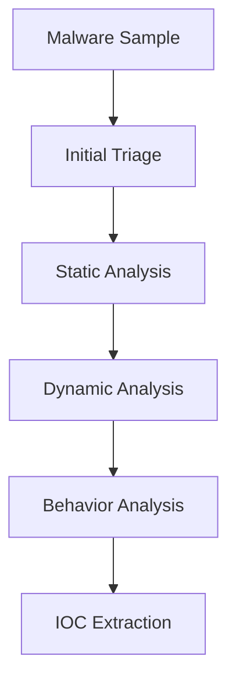

# Week 05 — Malware Analysis Workflow

---

# Ringkasan

Pada pertemuan minggu kelima, saya mempelajari **workflow dasar Malware Analysis** sebagai bagian dari penerapan Reverse Engineering dalam bidang cybersecurity. Materi ini membahas tahapan analisis malware secara sistematis mulai dari tahap awal pengumpulan informasi hingga penarikan kesimpulan berdasarkan hasil observasi.

Melalui pembelajaran ini, saya memahami bahwa malware analysis bukan hanya sekadar menjalankan atau membongkar file binary, tetapi membutuhkan alur kerja yang terstruktur agar proses analisis dapat dilakukan secara aman, konsisten, dan dapat dipertanggungjawabkan.

---

# Pembahasan Materi

## 1. Pengertian Malware Analysis

**Malware Analysis** adalah proses mempelajari perangkat lunak berbahaya untuk memahami cara kerja, tujuan, serta dampaknya terhadap sistem.

Tujuan utama malware analysis meliputi:

- Mengidentifikasi perilaku malware
- Menentukan tingkat ancaman
- Menemukan Indicators of Compromise (IOC)
- Mendukung incident response
- Membantu proses mitigasi dan pencegahan serangan

Dalam cybersecurity, malware analysis menjadi fondasi penting untuk memahami ancaman secara mendalam dan sistematis.

---

## 2. Workflow Malware Analysis

Proses malware analysis dilakukan melalui beberapa tahapan berurutan yang saling melengkapi.

Alur umumnya sebagai berikut:

```text
Malware Sample
      │
      ▼
Initial Triage
      │
      ▼
Static Analysis
      │
      ▼
Dynamic Analysis
      │
      ▼
Behavior Analysis
      │
      ▼
IOC Extraction
```

Setiap tahap memiliki peran penting dalam membangun pemahaman terhadap malware secara menyeluruh.

---

## 3. Initial Triage

**Initial triage** adalah tahap awal untuk mengumpulkan informasi dasar mengenai malware tanpa menjalankannya.

Informasi yang dianalisis meliputi:

- Nama file
- Tipe file
- Ukuran file
- Hash (MD5/SHA256)
- Arsitektur binary
- Indikasi packing atau obfuscation

Tools yang digunakan pada tahap ini:

- `CertUtil`
- `sha256sum`
- Detect It Easy (DIE)
- PE-bear

Tahap ini membantu memberikan gambaran awal sebelum masuk ke analisis yang lebih dalam.

---

## 4. Static Analysis

**Static analysis** dilakukan tanpa mengeksekusi malware, sehingga lebih aman untuk memahami struktur internal file.

Fokus analisis meliputi:

- Strings analysis
- Import table analysis
- Struktur PE file
- Identifikasi fungsi penting

Dari tahap ini, analyst dapat memprediksi kemampuan malware, misalnya:

- Import networking API → indikasi komunikasi jaringan
- Import registry API → indikasi modifikasi registry
- Import file API → indikasi manipulasi file system

Static analysis menjadi dasar penting sebelum melakukan analisis runtime.

---

## 5. Dynamic Analysis

**Dynamic analysis** dilakukan dengan menjalankan malware di lingkungan yang aman seperti virtual machine atau sandbox.

Tujuan utama tahap ini:

- Mengamati perilaku runtime malware
- Memvalidasi hasil static analysis
- Menganalisis dampak langsung terhadap sistem

Aktivitas yang diamati meliputi:

- Process creation
- File system changes
- Registry modification
- Network activity

Dengan dynamic analysis, perilaku nyata malware dapat dipahami secara langsung.

---

## 6. Indicators of Compromise (IOC)

Setelah proses analisis selesai, hasilnya dirangkum dalam bentuk **IOC (Indicators of Compromise)**.

Contoh IOC meliputi:

- File hash (MD5/SHA256)
- Domain atau IP mencurigakan
- Path file berbahaya
- Registry key yang dimodifikasi
- Nama proses mencurigakan

IOC digunakan untuk membantu deteksi dan mitigasi malware pada sistem lain yang mungkin terinfeksi.

---

# Diagram Malware Analysis Workflow



---

# Insight Minggu Ini

Dari materi minggu ini, saya memahami bahwa malware analysis merupakan proses yang sangat terstruktur dan tidak bisa dilakukan secara sembarangan. Setiap tahap memiliki peran penting dalam membangun pemahaman terhadap karakteristik malware.

Saya juga memahami bahwa keamanan dalam proses analisis sangat penting, sehingga penggunaan environment terisolasi seperti virtual machine menjadi keharusan agar sistem utama tidak terdampak.

---

# Tools yang Dipelajari

- CertUtil
- sha256sum
- Detect It Easy (DIE)
- PE-bear
- Ghidra
- Wireshark
- Process Monitor
- VirtualBox

---

# Refleksi Pembelajaran

## Apa yang Saya Pahami

Saya memahami bahwa malware analysis memiliki workflow yang jelas dan sistematis, dimulai dari initial triage, static analysis, hingga dynamic analysis. Saya juga memahami bahwa setiap tahap memberikan perspektif yang berbeda terhadap malware yang sedang dianalisis.

Selain itu, saya mengerti bahwa hasil akhir analisis biasanya dirangkum dalam bentuk IOC yang sangat penting untuk deteksi dan mitigasi ancaman.

---

## Apa yang Masih Membingungkan

Saya masih ingin memahami lebih dalam bagaimana malware modern menerapkan teknik **anti-analysis**, seperti obfuscation, packing, anti-debugging, dan anti-virtual machine untuk menghindari proses analisis.

---

## Kesimpulan Pribadi

Materi minggu kelima memberikan fondasi penting dalam memahami workflow malware analysis. Dengan adanya tahapan yang terstruktur, proses reverse engineering menjadi lebih sistematis, aman, dan efektif dalam mengidentifikasi ancaman keamanan.

---
