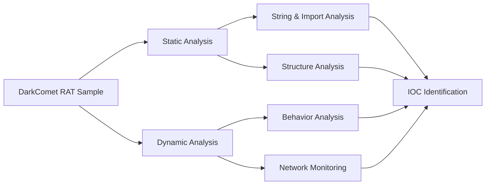

# Week 06 — Malware Analysis Case Study: DarkComet RAT

---

# Ringkasan

Pada pertemuan minggu keenam, saya mempelajari penerapan Reverse Engineering secara praktis melalui studi kasus malware. Materi ini berfokus pada proses analisis malware menggunakan kombinasi **Static Analysis** dan **Dynamic Analysis** untuk memahami perilaku, fungsi, dan dampak dari program berbahaya.

Studi kasus yang digunakan pada minggu ini adalah **DarkComet RAT (Remote Access Trojan)**, salah satu malware yang digunakan untuk mengendalikan sistem korban dari jarak jauh. Melalui analisis ini, saya memahami bagaimana sebuah RAT bekerja dalam memberikan akses penuh kepada attacker terhadap sistem target tanpa sepengetahuan korban.

---

# Pembahasan Materi

## 1. Apa Itu Malware Analysis?

**Malware Analysis** adalah proses menganalisis perangkat lunak berbahaya untuk memahami:

- Cara kerja malware
- Tujuan malware dibuat
- Teknik serangan yang digunakan
- Dampak terhadap sistem

Tujuan utama dari malware analysis adalah untuk mengidentifikasi ancaman, memahami perilaku malware, serta membantu proses mitigasi dan respons insiden keamanan.

Dalam praktiknya, malware analysis dilakukan menggunakan dua pendekatan utama:

- Static Analysis (analisis tanpa eksekusi)
- Dynamic Analysis (analisis saat program berjalan)

---

## 2. Mengenal DarkComet RAT

**DarkComet RAT** adalah jenis malware **Remote Access Trojan** yang memungkinkan attacker untuk mengontrol komputer korban dari jarak jauh.

Kemampuan umum DarkComet RAT meliputi:

- Mengambil kontrol penuh sistem korban
- Keylogging (mencatat input keyboard)
- Mengakses webcam dan mikrofon
- Mengambil file dari sistem korban
- Menjalankan command pada sistem target
- Monitoring aktivitas pengguna

Alur kerja umum DarkComet RAT:

```text
Infection
   │
   ▼
Persistence Establishment
   │
   ▼
Remote Connection to Attacker
   │
   ▼
System Control (RAT Panel)
   │
   ▼
Data Exfiltration / Surveillance
```

---

## 3. Static Analysis pada DarkComet RAT

Pada tahap static analysis, saya menganalisis file malware tanpa menjalankannya untuk melihat struktur dan indikasi perilaku.

Hal yang dianalisis meliputi:

- Strings dalam binary
- Import table
- Struktur file executable
- Referensi fungsi

Beberapa indikasi yang ditemukan pada RAT umumnya:

- Koneksi jaringan (socket communication)
- Fungsi keylogging
- API Windows untuk system control
- Fungsi persistence (startup / registry)

Static analysis membantu mengidentifikasi bahwa malware memiliki kemampuan remote access dan monitoring sistem.

---

## 4. Import Analysis

Import table pada DarkComet RAT menunjukkan penggunaan API yang berhubungan dengan:

- Network communication (Winsock)
- File manipulation
- System control
- Process management

Beberapa contoh fungsi yang relevan:

- `WSAStartup()`
- `socket()`
- `connect()`
- `send()` / `recv()`
- `CreateProcess()`
- `WriteFile()` / `ReadFile()`
- `RegSetValueEx()`

Dari import ini dapat disimpulkan bahwa DarkComet RAT memiliki kemampuan:

- Membuat koneksi jaringan ke attacker
- Mengirim dan menerima data
- Menjalankan perintah dari remote
- Memodifikasi sistem untuk persistence

---

## 5. Dynamic Analysis pada DarkComet RAT

Pada tahap dynamic analysis, malware dijalankan di lingkungan virtual yang aman (sandbox) untuk mengamati perilakunya secara langsung.

Tahapan analisis:

1. Menyiapkan virtual machine
2. Menjalankan malware sample
3. Monitoring proses aktif
4. Monitoring network traffic
5. Observasi perubahan sistem

Perilaku yang biasanya diamati:

- Koneksi ke IP eksternal (C2 server)
- Pembuatan proses baru
- Aktivitas keylogging
- Perubahan registry untuk persistence
- Aktivitas file transfer

Dynamic analysis membantu memvalidasi hasil static analysis dengan melihat perilaku nyata malware saat berjalan.

---

## 6. Indicators of Compromise (IOC)

Dari hasil analisis DarkComet RAT, beberapa IOC yang dapat ditemukan antara lain:

- Koneksi ke IP asing (Command & Control server)
- Aktivitas network tidak normal
- Proses berjalan di background tanpa UI jelas
- Modifikasi registry startup
- Aktivitas keylogging
- Transfer data keluar sistem (exfiltration)

IOC ini penting untuk mendeteksi keberadaan RAT dalam sistem yang sudah terinfeksi.

---

# Diagram Malware Analysis Workflow



---

# Insight Minggu Ini

Dari materi minggu ini, saya memahami bahwa DarkComet RAT merupakan contoh nyata bagaimana malware dapat digunakan untuk mengambil alih kontrol sistem korban secara penuh dari jarak jauh.

Saya juga memahami bahwa kombinasi static analysis dan dynamic analysis sangat penting untuk memahami kemampuan RAT, terutama karena sebagian besar aktivitasnya berkaitan dengan jaringan dan sistem operasi secara langsung.

---

# Tools yang Dipelajari

- Ghidra
- PE-bear
- Wireshark
- Process Monitor
- x64dbg
- VirtualBox

---

# Refleksi Pembelajaran

## Apa yang Saya Pahami

Saya memahami bahwa DarkComet RAT bekerja dengan membangun koneksi ke attacker dan memberikan akses penuh terhadap sistem korban. Saya juga memahami bahwa analisis strings, import table, dan network traffic sangat penting dalam mengidentifikasi perilaku RAT.

---

## Apa yang Masih Membingungkan

Saya masih ingin memahami lebih dalam bagaimana RAT modern melakukan bypass antivirus serta teknik obfuscation yang digunakan untuk menyembunyikan komunikasi dengan command and control server.

---

## Kesimpulan Pribadi

Materi minggu keenam memberikan pemahaman yang lebih nyata mengenai ancaman malware jenis RAT. Dari studi kasus DarkComet, saya memahami bahwa reverse engineering sangat penting dalam mendeteksi dan menganalisis malware yang berfokus pada kontrol jarak jauh dan pencurian data.

---
