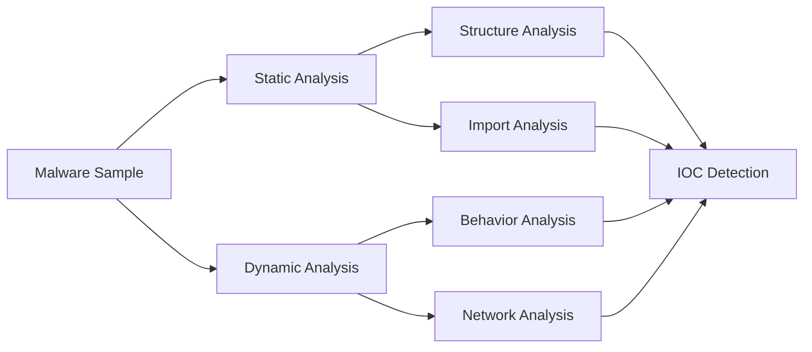

# Week 06 — Malware Analysis Case Study: WannaCry

---

# Ringkasan

Pada pertemuan keenam, saya mulai mempelajari penerapan **Reverse Engineering** secara lebih praktis melalui **Malware Analysis**. Materi ini membahas bagaimana malware dapat dianalisis menggunakan kombinasi **Static Analysis** dan **Dynamic Analysis** untuk memahami karakteristik, perilaku, serta dampaknya terhadap sistem.

Studi kasus yang digunakan adalah **WannaCry**, salah satu ransomware paling terkenal yang menyebabkan serangan siber berskala global pada tahun 2017. Melalui analisis terhadap WannaCry, saya memahami bahwa reverse engineering memiliki peran yang sangat penting dalam mengidentifikasi ancaman, memahami mekanisme serangan, serta membantu proses mitigasi dan respons terhadap insiden keamanan.

---

# Pembahasan Materi

## 1. Pengertian Malware Analysis

**Malware Analysis** adalah proses menganalisis perangkat lunak berbahaya (malware) untuk memahami bagaimana malware tersebut bekerja, tujuan pembuatannya, serta dampak yang dapat ditimbulkan terhadap sistem yang terinfeksi.

Beberapa tujuan utama malware analysis meliputi:

- Memahami cara kerja malware.
- Mengidentifikasi teknik serangan yang digunakan.
- Mengetahui kemampuan dan tujuan malware.
- Mendukung proses mitigasi serta incident response.
- Menghasilkan indikator kompromi (*Indicators of Compromise* / IOC).

Dalam praktiknya, malware analysis dilakukan menggunakan dua pendekatan utama, yaitu:

- **Static Analysis**, yaitu analisis tanpa menjalankan malware.
- **Dynamic Analysis**, yaitu analisis dengan mengamati perilaku malware ketika dijalankan pada lingkungan yang aman.

Kedua metode tersebut saling melengkapi sehingga menghasilkan pemahaman yang lebih komprehensif mengenai suatu malware.

---

## 2. Mengenal WannaCry

**WannaCry** merupakan ransomware yang menargetkan sistem operasi Windows dengan memanfaatkan kerentanan pada layanan **SMB (Server Message Block)**. Setelah berhasil menginfeksi sistem, malware akan mengenkripsi berbagai file milik korban dan menampilkan permintaan tebusan (*ransom*) dalam bentuk cryptocurrency agar file dapat dipulihkan.

Secara umum, alur serangan WannaCry dapat digambarkan sebagai berikut:

```text
System Infection
       │
       ▼
Exploit Vulnerability
       │
       ▼
Payload Execution
       │
       ▼
File Encryption
       │
       ▼
Ransom Demand
```

Kasus WannaCry menjadi salah satu contoh penting dalam pembelajaran reverse engineering karena memperlihatkan bagaimana sebuah malware dapat menggabungkan eksploitasi kerentanan, mekanisme penyebaran, persistence, dan proses enkripsi file dalam satu rangkaian serangan.

---

## 3. Static Analysis pada WannaCry

Pada tahap **Static Analysis**, malware dianalisis tanpa dijalankan sehingga proses analisis lebih aman dan tidak menimbulkan risiko terhadap sistem.

Beberapa aspek yang dianalisis meliputi:

- Struktur file executable.
- Strings yang tersimpan di dalam binary.
- Import Table.
- Referensi fungsi (*Function References*).

Melalui analisis tersebut ditemukan beberapa string yang menunjukkan karakteristik ransomware, antara lain:

- `.WNCRY`
- `taskse.exe`
- `mssecsvc.exe`

Keberadaan string tersebut memberikan petunjuk mengenai proses enkripsi file, penggunaan service Windows, serta berbagai komponen internal malware.

Static analysis juga membantu memperoleh gambaran awal mengenai kemampuan malware sebelum dilakukan analisis yang lebih mendalam.

---

## 4. Import Analysis

Salah satu bagian penting dalam static analysis adalah **Import Analysis**, yaitu proses mengidentifikasi library dan fungsi (*API*) yang digunakan oleh malware.

Beberapa library yang ditemukan antara lain:

- `KERNEL32.dll`
- `USER32.dll`
- `ADVAPI32.dll`
- `MSVCRT.dll`

Selain itu, ditemukan pula beberapa fungsi penting seperti:

- `CreateServiceA()`
- `OpenServiceA()`
- `StartServiceA()`
- `fopen()`
- `fread()`
- `fwrite()`

Dari fungsi-fungsi tersebut dapat disimpulkan bahwa malware memiliki kemampuan untuk:

- Membuat dan menjalankan service baru.
- Mengakses service Windows.
- Membaca file dari sistem.
- Menulis atau memodifikasi file.
- Mengelola proses penyimpanan data.

Import analysis memberikan gambaran mengenai kemampuan malware bahkan sebelum malware dijalankan secara langsung.

---

## 5. Dynamic Analysis pada WannaCry

Selain static analysis, materi minggu ini juga membahas **Dynamic Analysis**, yaitu proses mengamati perilaku malware ketika dijalankan pada lingkungan yang aman (*sandbox*).

Tahapan analisis yang dilakukan meliputi:

1. Menyiapkan virtual environment.
2. Menjalankan malware di lingkungan terisolasi.
3. Mengamati aktivitas sistem.
4. Memonitor komunikasi jaringan.
5. Mendokumentasikan seluruh hasil analisis.

Selama proses tersebut, beberapa perilaku yang dapat diamati antara lain:

- Perubahan pada file system.
- Aktivitas service Windows.
- Modifikasi registry.
- Komunikasi jaringan yang mencurigakan.
- Proses enkripsi file.

Dynamic analysis berfungsi untuk memvalidasi temuan yang diperoleh dari static analysis sekaligus memperlihatkan perilaku malware secara nyata selama proses eksekusi.

---

## 6. Indicators of Compromise (IOC)

Hasil analisis malware menghasilkan berbagai **Indicators of Compromise (IOC)**, yaitu indikator yang dapat digunakan untuk mendeteksi keberadaan malware pada suatu sistem.

Beberapa IOC yang berhasil diidentifikasi meliputi:

- File korban yang telah terenkripsi.
- Perubahan pada Windows Registry.
- Pembuatan service baru.
- Aktivitas jaringan yang tidak normal.
- Perubahan struktur file pada sistem.

IOC menjadi informasi yang sangat penting bagi tim keamanan karena dapat digunakan sebagai dasar dalam proses deteksi, investigasi, maupun penanganan insiden keamanan.

---

# Diagram Workflow Malware Analysis



---

# Hal Baru yang Saya Pelajari

Beberapa konsep baru yang saya pelajari pada minggu ini antara lain:

- Perbedaan antara Static Analysis dan Dynamic Analysis.
- Tahapan analisis malware menggunakan lingkungan yang aman.
- Cara membaca strings dan import table untuk memahami kemampuan malware.
- Pentingnya API Windows dalam mengidentifikasi fungsi malware.
- Konsep Indicators of Compromise (IOC) sebagai dasar deteksi ancaman.
- Penerapan reverse engineering dalam investigasi ransomware.

---

# Insight Minggu Ini

Materi minggu keenam memberikan gambaran nyata mengenai penerapan reverse engineering dalam dunia keamanan siber. Saya memahami bahwa malware analysis bukan sekadar membongkar file executable, tetapi juga bertujuan memahami bagaimana malware bekerja, bagaimana malware menyebar, serta bagaimana dampaknya terhadap sistem yang menjadi target.

Studi kasus WannaCry menunjukkan bahwa kombinasi antara static analysis dan dynamic analysis mampu menghasilkan informasi yang jauh lebih lengkap dibandingkan hanya menggunakan satu metode analisis saja. Saya juga menyadari bahwa hasil analisis malware sangat bermanfaat dalam membantu proses deteksi, mitigasi, dan respons terhadap serangan siber.

---

# Tools yang Dipelajari

- Ghidra
- PE-bear
- Wireshark
- Process Monitor
- VirtualBox

---

# Refleksi Pembelajaran

## Apa yang Saya Pahami

Setelah mempelajari materi minggu keenam, saya memahami bahwa malware analysis merupakan salah satu penerapan utama reverse engineering dalam bidang cybersecurity. Saya mengetahui bagaimana proses analisis dilakukan mulai dari membaca struktur internal malware hingga mengamati perilakunya selama dijalankan di lingkungan yang aman.

Saya juga memahami bahwa informasi seperti strings, import table, aktivitas sistem, serta komunikasi jaringan dapat digunakan untuk mengidentifikasi karakteristik dan kemampuan suatu malware.

## Apa yang Masih Membingungkan

Saya masih ingin mempelajari bagaimana malware modern menggunakan teknik **obfuscation**, **packing**, maupun **anti-analysis** untuk menghindari proses reverse engineering. Selain itu, saya juga ingin memahami analisis malware yang dilakukan pada level memori (*memory analysis*) serta teknik analisis terhadap perilaku malware selama runtime yang lebih kompleks.

## Kesimpulan Pribadi

Materi minggu keenam memberikan pengalaman yang sangat menarik karena saya mulai melihat bagaimana teori reverse engineering diterapkan secara langsung dalam analisis malware. Studi kasus WannaCry menunjukkan bahwa pemahaman mengenai struktur executable, import analysis, serta perilaku program sangat membantu dalam mengidentifikasi ancaman keamanan. Materi ini semakin memperkuat pemahaman saya bahwa reverse engineering memiliki peran yang sangat penting dalam mendukung proses deteksi, investigasi, dan mitigasi serangan siber.

---
