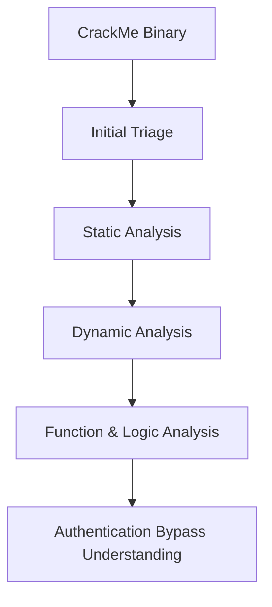

# Week 07 — CrackMe Analysis and Basic Binary Reversing

---

# Ringkasan

Pada pertemuan minggu ketujuh, saya mulai mempelajari praktik **Reverse Engineering** melalui analisis **CrackMe**. CrackMe merupakan program kecil yang dirancang khusus untuk melatih kemampuan analisis binary, debugging, serta pemahaman terhadap logic program.

Materi minggu ini berfokus pada proses memahami alur autentikasi program, menemukan mekanisme validasi input, serta menganalisis conditional logic yang menentukan apakah input pengguna diterima atau ditolak. Melalui pembelajaran ini, saya mulai memahami bagaimana reverse engineering digunakan untuk membongkar cara kerja internal sebuah executable secara sistematis.

---

# Pembahasan Materi

## 1. Pengertian CrackMe

**CrackMe** adalah program executable yang dibuat khusus untuk tujuan pembelajaran reverse engineering. Program ini biasanya memiliki tantangan tertentu yang harus dianalisis, seperti:

- Menemukan password yang benar
- Melakukan bypass autentikasi
- Memahami logic validasi input
- Mencari hidden flag atau kondisi tertentu

Tujuan utama CrackMe bukan untuk merusak sistem, melainkan sebagai media latihan yang legal untuk memahami bagaimana sebuah program mengambil keputusan berdasarkan input.

Secara sederhana, alur CrackMe dapat digambarkan sebagai berikut:

```text
User Input
     │
     ▼
Validation Logic
     │
 ┌───┴────┐
 │        │
True     False
 │        │
 ▼        ▼
Access Granted / Access Denied
```

Tantangan utama dalam CrackMe adalah memahami bagaimana validation logic tersebut diimplementasikan pada level binary.

---

## 2. Tahapan Analisis CrackMe

Dalam proses analisis CrackMe, terdapat beberapa tahapan yang umum dilakukan.

### Initial Triage

Tahap awal bertujuan untuk mengumpulkan informasi dasar mengenai executable sebelum dianalisis lebih lanjut.

Informasi yang biasanya diperiksa:

- Tipe file
- Arsitektur (x86/x64)
- Strings yang terdapat dalam binary
- Import functions
- Indikasi packing atau obfuscation

Tahap ini membantu menentukan pendekatan analisis yang paling tepat.

---

### Static Analysis

**Static analysis** dilakukan tanpa menjalankan program. Fokus utama tahap ini adalah memahami struktur internal dan kemungkinan logic yang ada di dalam executable.

Hal yang dianalisis meliputi:

- Function analysis
- Strings analysis
- Cross reference (XREF)
- Struktur kontrol program
- Indikasi authentication logic

Dari tahap ini, analis dapat memperkirakan bagian mana dari program yang berhubungan dengan proses validasi input.

---

### Dynamic Analysis

**Dynamic analysis** dilakukan dengan menjalankan program di lingkungan yang aman menggunakan debugger.

Tujuan utama tahap ini adalah:

- Mengamati alur eksekusi secara real-time
- Memahami conditional branching
- Melihat respons program terhadap input
- Menentukan titik keputusan (decision point)

Dynamic analysis membantu memvalidasi hasil static analysis dengan melihat perilaku program secara langsung.

---

## 3. Authentication Logic dalam CrackMe

Fokus utama CrackMe adalah memahami bagaimana program melakukan validasi input pengguna.

Contoh logic sederhana:

```text
if (password == "admin123") {
    access_granted();
} else {
    access_denied();
}
```

Pada level binary, logic tersebut biasanya direpresentasikan sebagai:

- Compare instruction
- Conditional jump
- Branching execution flow

Alur sederhananya:

```text
Input
  │
  ▼
Compare
  │
 ┌┴┐
 │ │
EQ NE
 │ │
 ▼ ▼
TRUE FALSE
 │     │
 ▼     ▼
OK   FAIL
```

Dari sini saya memahami bahwa inti CrackMe terletak pada bagaimana conditional logic diterjemahkan ke dalam instruksi assembly.

---

## 4. Conditional Jump

Dalam analisis binary, **conditional jump** merupakan elemen yang sangat penting karena menentukan arah eksekusi program.

Beberapa instruksi yang sering digunakan:

- `JE` (Jump if Equal)
- `JNE` (Jump if Not Equal)
- `JZ` (Jump if Zero)
- `JNZ` (Jump if Not Zero)

Instruksi tersebut bekerja berdasarkan hasil operasi sebelumnya, biasanya hasil dari instruksi `CMP` (compare).

Cara kerjanya:

- Jika kondisi terpenuhi → program melompat ke blok success
- Jika kondisi tidak terpenuhi → program menuju blok failure

Memahami conditional jump sangat penting dalam proses analisis CrackMe karena di sinilah keputusan program ditentukan.

---

## 5. Tools untuk Analisis CrackMe

Beberapa tools yang digunakan dalam analisis CrackMe antara lain:

| Tools | Fungsi |
|------|--------|
| IDA Free | Static analysis & disassembly |
| Ghidra | Disassembler & decompiler |
| x64dbg | Debugging dan dynamic analysis |
| HxD | Hex editing |

Tools ini saling melengkapi dalam membantu memahami logic internal sebuah executable.

---

# Diagram CrackMe Workflow



---

# Insight Minggu Ini

Dari materi minggu ini, saya memahami bahwa CrackMe merupakan sarana latihan yang sangat efektif untuk mengembangkan kemampuan reverse engineering. Melalui pendekatan ini, saya belajar bagaimana membaca alur program, memahami logika validasi, serta menganalisis branching pada level binary.

Saya juga menyadari bahwa reverse engineering bukan hanya soal membaca assembly, tetapi juga melatih cara berpikir logis untuk memahami bagaimana sebuah program membuat keputusan berdasarkan input pengguna.

---

# Tools yang Dipelajari

- IDA Free
- Ghidra
- x64dbg
- HxD

---

# Refleksi Pembelajaran

## Apa yang Saya Pahami

Saya memahami bahwa CrackMe digunakan sebagai media latihan untuk mempelajari reverse engineering secara praktis. Saya mulai memahami bagaimana authentication logic bekerja di level binary dan bagaimana conditional jump menentukan alur eksekusi program.

Saya juga memahami bahwa kombinasi static analysis dan dynamic analysis sangat penting untuk memahami executable secara lebih menyeluruh.

---

## Apa yang Masih Membingungkan

Saya masih ingin memahami lebih dalam cara membaca assembly code dengan lebih cepat, serta bagaimana mengidentifikasi pola validation logic yang lebih kompleks pada program yang ukurannya lebih besar.

---

## Kesimpulan Pribadi

Materi minggu ketujuh memberikan pengalaman praktis pertama dalam memahami logic internal executable. Melalui CrackMe, saya mulai memahami bahwa reverse engineering sangat bergantung pada kemampuan analisis logika, bukan hanya pemahaman teknis semata.

---
